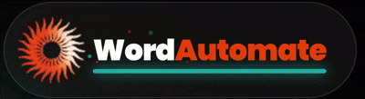

  

   

  <h1 style="border-bottom: none; margin-bottom: 0px; font-size: 36px; font-weight: 800; color: #F3F2ED;">
    Stop Typing. Start Automating. ⚡
  </h1>
  
  

    The ultimate lab documentation engine built exclusively for <b>SIES GST Students</b>.  
    Connect your <b style="color: #0078D4;">Microsoft ID</b>, upload a template, and generate <b>multiple Lab Reports</b> in seconds.
  

   

  

    
    &nbsp;&nbsp;&nbsp;
    
  

  

    
    &nbsp;
    
    &nbsp;
    
  

 

  

 
